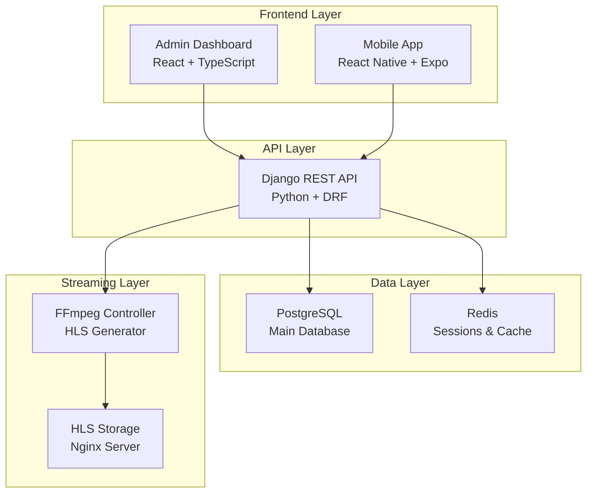

# 🎯 ArenaStream - Sports Streaming Platform

<div align="center">


**منصة احترافية لبث الفعاليات الرياضية المباشرة**

[](https://reactjs.org/)
[](https://djangoproject.com/)
[](https://reactnative.dev/)
[](https://www.typescriptlang.org/)

</div>

---

## 📋 نظرة عامة

**ArenaStream** هو نظام SaaS متكامل لإدارة وبث الفعاليات الرياضية المباشرة، يتكون من ثلاثة مكونات رئيسية:

- 🖥️ **Admin Dashboard** - واجهة إدارة شاملة للتحكم في النظام
- ⚙️ **Backend API** - REST API قوي مبني بـ Django
- 📱 **Mobile App** - تطبيق موبايل للمستخدمين النهائيين

---

## 🏗️ البنية المعمارية



---

## 📂 هيكل المشروع

```
arena_stream/
│
├── 📁 arena-stream-admin-frontend/    # React Admin Dashboard
│   ├── src/
│   │   ├── components/               # مكونات UI
│   │   ├── pages/                    # صفحات التطبيق
│   │   ├── lib/                      # مكتبات مساعدة
│   │   └── hooks/                    # Custom Hooks
│   ├── package.json
│   ├── vite.config.ts
│   └── bot.MD                        # 📄 Frontend Documentation
│
├── 📁 arena-stream-api-backend/       # Django REST API
│   ├── arena_core/                   # Django Project
│   ├── stream_api/                    # Main App
│   ├── requirements.txt
│   ├── Dockerfile
│   ├── docker-compose.yml
│   └── bot.MD                        # 📄 Backend Documentation
│
├── 📁 arena-stream-mobile/            # React Native Mobile App
│   ├── src/
│   │   ├── components/               # مكونات UI
│   │   ├── screens/                  # شاشات التطبيق
│   │   ├── navigation/               # نظام التنقل
│   │   ├── services/                # خدمات API
│   │   └── hooks/                    # Custom Hooks
│   ├── App.tsx
│   ├── package.json
│   └── bot.MD                        # 📄 Mobile Documentation
│
├── 📄 README.md                       # هذا الملف
├── 📄 .gitignore                      # Git Ignore Rules
└── 📄 LICENSE                         # رخصة المشروع
```

---

## 🚀 البدء السريع

### المتطلبات الأساسية

```bash
# للـ Backend
- Python 3.11+
- PostgreSQL 15+
- Redis 7+

# للـ Frontend
- Node.js 18+
- npm or yarn

# للـ Mobile
- Node.js 18+
- Expo CLI
- iOS Simulator / Android Emulator
```

### التثبيت والتشغيل

#### 1. استنساخ المشروع
```bash
git clone https://github.com/yourusername/arena-stream.git
cd arena-stream
```

#### 2. Backend API
```bash
cd arena-stream-api-backend

# إنشاء البيئة الافتراضية
python -m venv venv
source venv/bin/activate  # Windows: venv\Scripts\activate

# تثبيت المكتبات
pip install -r requirements.txt

# إعداد قاعدة البيانات
python manage.py migrate
python manage.py createsuperuser

# تشغيل السيرفر
python manage.py runserver
# يفتح على http://localhost:8000
```

#### 3. Admin Dashboard
```bash
cd arena-stream-admin-frontend

# تثبيت المكتبات
npm install

# تشغيل في وضع التطوير
npm run dev
# يفتح على http://localhost:5173
```

#### 4. Mobile App
```bash
cd arena-stream-mobile

# تثبيت المكتبات
npm install

# تشغيل المشروع
npm start

# اختر:
# - اضغط 'i' لـ iOS Simulator
# - اضغط 'a' لـ Android Emulator
# - امسح QR code باستخدام Expo Go app
```

---

## 📊 حالة الإنجاز

| المكون | الحالة | النسبة | الوصف |
|--------|--------|---------|-------|
| **Admin Frontend** | 🟢 جاهز للتطوير | **70%** | واجهة إدارة شاملة مع بيانات وهمية |
| **Backend API** | 🟢 جاهز للتشغيل | **95%** | Django REST API مكتمل مع Admin endpoints و Unit Tests |
| **Mobile App** | 🟡 قيد الإنشاء | **60%** | شاشات أساسية مكتملة مع Video Player متقدم |
| **إجمالي المشروع** | 🟢 | **75%** | مشروع جاهز للتشغيل والتطوير |

---

## 🎯 الميزات الرئيسية

### 🖥️ Admin Dashboard
- ✅ إدارة المستخدمين والاشتراكات
- ✅ التحكم في قنوات البث المباشر
- ✅ جدولة الفعاليات والمباريات
- ✅ مراقبة المشاهدين النشطين
- ✅ تحليلات شاملة وإحصائيات
- ✅ إدارة الأجهزة والحدود

### ⚙️ Backend API
- ✅ نظام مصادقة JWT متقدم
- ✅ إدارة المستخدمين والاشتراكات
- ✅ CRUD للقنوات والفعاليات
- ✅ تحكم في عدد الأجهزة (Redis)
- ✅ روابط HLS موقّعة (HMAC)
- ✅ تكامل FFmpeg Controller
- ✅ API Documentation (Swagger)
- ✅ Django Admin Panel
- ✅ Docker Support
- ✅ Admin endpoints شاملة
- ✅ Unit Tests كاملة
- ✅ Live Viewers Management

### 📱 Mobile App
- ✅ تسجيل الدخول مع تصميم متقدم
- ✅ الصفحة الرئيسية مع قنوات مباشرة
- ✅ مشغل فيديو HLS متقدم مع controls
- ✅ تصميم Dark Mode احترافي
- ✅ Navigation structure كامل
- ⏳ تصفح القنوات والفعاليات
- ⏳ نظام المفضلة
- ⏳ إدارة الحساب والاشتراك
- ❌ إشعارات Push

---

## 🔧 التقنيات المستخدمة

### Frontend (Admin Dashboard)
```json
{
  "framework": "React 18 + TypeScript",
  "ui_library": "shadcn/ui (Radix UI)",
  "styling": "Tailwind CSS",
  "routing": "React Router v6",
  "state": "React Query (TanStack Query)",
  "forms": "React Hook Form",
  "video_player": "hls.js",
  "charts": "Recharts",
  "build_tool": "Vite"
}
```

### Backend (API)
```json
{
  "framework": "Django 5 + Django REST Framework",
  "database": "PostgreSQL",
  "cache": "Redis",
  "authentication": "SimpleJWT",
  "docs": "drf-spectacular (OpenAPI/Swagger)",
  "cors": "django-cors-headers",
  "server": "Gunicorn + Nginx",
  "streaming": "FFmpeg Controller Integration"
}
```

### Mobile App
```json
{
  "framework": "React Native (Expo SDK 54)",
  "language": "TypeScript",
  "navigation": "React Navigation 7",
  "state": "React Query (TanStack Query)",
  "ui": "React Native Paper",
  "styling": "NativeWind (Tailwind for RN)",
  "video": "react-native-video + expo-av",
  "auth": "AsyncStorage + JWT",
  "notifications": "Expo Notifications"
}
```

---

## 🔒 الأمان

### التدابير الأمنية المطبقة/المخططة

| التدبير | الحالة | الوصف |
|---------|--------|-------|
| JWT Authentication | ⏳ مخطط | توكنات قصيرة المدى + Refresh |
| HTTPS Enforcement | ⏳ مخطط | إجباري على Production |
| CORS Whitelisting | ⏳ مخطط | نطاقات محددة فقط |
| Signed HLS URLs | ⏳ مخطط | روابط موقّعة بـ HMAC |
| Device Limit | ⏳ مخطط | Redis-based sessions |
| Rate Limiting | ⏳ مخطط | DRF Throttling |
| SQL Injection Prevention | ✅ مطبق | Django ORM |
| XSS Prevention | ✅ مطبق | React auto-escaping |
| Password Hashing | ✅ مطبق | Django bcrypt |

---

## 📋 خارطة الطريق

### المرحلة 1: Backend Setup (أسبوع 1-2) ✅ مكتمل
- [x] إنشاء Django project
- [x] إعداد PostgreSQL + Redis
- [x] إنشاء Models (User, Subscription, Channel, Event)
- [x] تنفيذ JWT Authentication
- [x] إنشاء الـ API Endpoints الأساسية
- [x] تنفيذ Device Limit Logic
- [x] تكامل FFmpeg Controller
- [x] إعداد Django Admin
- [x] إنشاء Docker Support

### المرحلة 2: Mobile App Core (أسبوع 3-4)
- [ ] إعداد Expo + Navigation
- [ ] تنفيذ Login/Register
- [ ] إنشاء Home Screen
- [ ] تنفيذ Video Player
- [ ] ربط API Endpoints
- [ ] اختبار HLS Playback

### المرحلة 3: Admin Dashboard Integration (أسبوع 5)
- [ ] ربط Frontend بـ API
- [ ] استبدال Mock Data
- [ ] تنفيذ JWT Auth
- [ ] اختبار جميع الصفحات

### المرحلة 4: Advanced Features (أسبوع 6-7)
- [ ] Push Notifications (Mobile)
- [ ] WebSocket للبيانات الفورية (Admin)
- [ ] تحسين الأداء
- [ ] إضافة Caching
- [ ] تحسين Video Quality Selection

### المرحلة 5: Testing & Deployment (أسبوع 8)
- [ ] Unit Tests (Backend)
- [ ] Integration Tests
- [ ] UI Tests (Mobile)
- [ ] إعداد Docker Compose
- [ ] إعداد CI/CD
- [ ] النشر على Production

---

## 🤝 المساهمة

### Git Workflow
```bash
# للبدء
git checkout -b feature/your-feature-name

# بعد الانتهاء
git add .
git commit -m "feat: add your feature"
git push origin feature/your-feature-name

# افتح Pull Request
```

### Commit Message Convention
```
feat: أضف ميزة جديدة
fix: إصلاح خطأ
docs: تحديث documentation
style: تعديلات تنسيق الكود
refactor: إعادة هيكلة الكود
test: إضافة اختبارات
chore: مهام صيانة
```

---

## 📚 الموارد والروابط

### Documentation
- [Django REST Framework](https://www.django-rest-framework.org/)
- [React Documentation](https://react.dev/)
- [React Native](https://reactnavigation.org/)
- [Expo Docs](https://docs.expo.dev/)
- [shadcn/ui](https://ui.shadcn.com/)

### Tools
- [Postman](https://www.postman.com/) - API Testing
- [Swagger UI](https://swagger.io/) - API Documentation
- [React DevTools](https://react.dev/learn/react-developer-tools)

---

## 📞 الدعم

للأسئلة أو المشاكل:
1. راجع ملفات `bot.MD` في كل مجلد فرعي
2. افتح Issue على GitHub
3. تواصل مع فريق التطوير

---

## 📄 الترخيص

هذا المشروع ملكية خاصة وغير متاح للاستخدام العام بدون إذن.

---

## 🎯 الخطوات التالية

### أولوية عالية جداً
1. **اختبار Backend API** - تشغيل السيرفر واختبار جميع الـ endpoints
2. **إكمال Mobile App** - راجع `arena-stream-mobile/bot.MD`

### أولوية عالية
3. **ربط Admin Frontend** بـ API الحقيقي
4. **اختبار التكامل** بين المكونات الثلاثة

### أولوية متوسطة
5. **إضافة ميزات متقدمة** (Push Notifications, WebSocket)
6. **تحسين الأداء** والأمان

---

## ✅ الخلاصة

### ما تم إنجازه
- ✅ Admin Frontend (70%)
- ✅ Backend API (85%) - مكتمل وجاهز للتشغيل
- ✅ Project Structure
- ✅ Documentation الكامل
- ✅ Docker Support

### ما يجب العمل عليه الآن
1. **أولوية عالية جداً:** اختبار Backend API وتشغيله
2. **أولوية عالية:** إكمال Mobile App الأساسية
3. **أولوية متوسطة:** ربط Admin Frontend بـ API
4. **أولوية منخفضة:** ميزات متقدمة + تحسينات

---

**🎯 الهدف القادم:** تشغيل Backend API واختبار جميع الـ endpoints

---

<div align="center">

**آخر تحديث:** أكتوبر 2025  
**الإصدار:** 0.1.0  
**الحالة:** 🟢 جاهز للتشغيل والتطوير

---

⭐ إذا أعجبك المشروع، لا تنسَ إعطاؤه نجمة!

</div>
